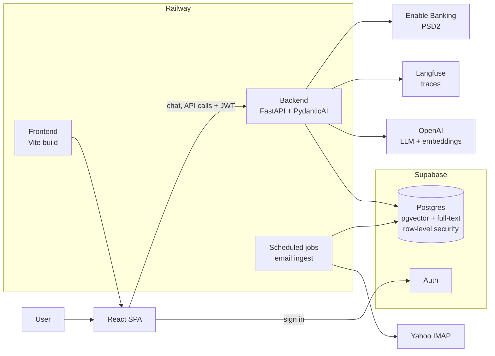

# Borbfolio

**A personal AI workspace with three agents: one for my inbox, one for my finances, one for research filings.** Each agent answers in plain language and cites its sources, and says so when the data doesn't support an answer.

Built end to end by [Borbála Tasnádi](https://tasnadi-ai.de), freelance AI engineer, as a working example of how I build AI products: specified first, tested, observable and deployed.

<!-- Demo videos: add links or embeds here. -->

## The agents

### Email Assistant: chat over a real inbox

- Ingests a Yahoo inbox over IMAP.
- Labels each message with a small classification model.
- Stores invoice PDFs.
- Splits AI newsletters into individual news items, and merges items that cover the same story across newsletters.
- Answers questions about the mail and "what was the big AI news this week?", citing the messages it used.

Details: [overview](docs/03-email/overview.md).

### Finance: invoices, bank accounts and payments (in progress)

- **Invoices:** taken from the mail.
- **Bank accounts:** N26, ING and PayPal, read through PSD2 open banking via Enable Banking. The app never sees bank logins.
- **Payments:** prepared as a GiroCode QR, so every transfer is confirmed in the bank's own app.

Plan and progress: [finance plan](docs/05-finance/plans/001-finance-agent/README.md).

### Document Copilot: research over SEC filings

Analysts ask questions about 10-K filings (Apple, Microsoft, NVIDIA, Amazon, Alphabet) and get answers in which every claim links to the passage it came from. If the filings don't cover a question, it says so instead of guessing. It's built around a client brief for a fictional research firm whose analysts lose half their week reading filings: [client brief](docs/01-document-copilot/client-brief.md), [architecture](docs/01-document-copilot/architecture.md).

## What this project demonstrates

- **Answers you can check.** The model must return structured citations. Code validates them before an answer is shown ([grounding.py](backend/app/grounding.py)), and "not enough evidence" is a first-class answer.
- **Hybrid retrieval.** Semantic search (pgvector) and keyword search (Postgres full-text) run separately and are fused with Reciprocal Rank Fusion; neighboring passages are added for context ([retrieval](backend/app/retrieval/README.md)).
- **Typed LLM orchestration.** PydanticAI agents with explicit tools, dependencies and output models, so the LLM path can be unit-tested like the rest of the code.
- **Observability.** Agent runs are traced with OpenTelemetry into Langfuse: latency per step, tokens, cost and tool calls ([evaluation plan](docs/02-evaluation/evals-todo.md)).
- **Security and privacy by default.**
  - The backend verifies Supabase auth tokens.
  - Every table has row-level security, and a test fails if one doesn't.
  - Personal agents are owner-only.
  - Bank access goes through a licensed PSD2 provider with signed requests and time-limited consent.
- **Production habits.**
  - Schema changes go through Alembic migrations.
  - CI runs lint, type checks and tests on every pull request, and the same checks run as pre-commit hooks.
  - Background jobs run on a schedule and are logged.
  - Dependencies are kept deliberately small.
- **Spec-driven, AI-assisted development.**
  - Each feature starts as a spec, with decisions, design and a task list ([docs](docs/README.md)).
  - Each task has acceptance criteria, and its verification is recorded before the task is ticked.
  - AI coding agents work under the rules in [AGENTS.md](AGENTS.md).

## Architecture



## Tech stack

| Layer | Choice |
| --- | --- |
| Backend | Python 3.12, FastAPI, PydanticAI, SQLAlchemy + Alembic |
| Frontend | Vite, React, TypeScript, Tailwind CSS, shadcn/ui |
| Data | Supabase Postgres with `pgvector` and full-text search |
| Auth | Supabase Auth |
| AI | OpenAI (chat and embeddings), TypeSafe Jev (mail labels) |
| Observability | OpenTelemetry, Langfuse |
| Integrations | Yahoo IMAP, Enable Banking (PSD2) |
| Hosting | Railway (frontend, backend, cron jobs) |
| Quality | pytest, ruff, ESLint, `tsc`, GitHub Actions, pre-commit |

## Repository

```text
folio/
├── AGENTS.md       # rules for AI coding agents (read first)
├── backend/        # FastAPI service, ingest jobs, tests
├── frontend/       # React SPA
├── data/           # SEC filing downloader (payloads gitignored)
└── docs/           # specs, plans and guides, one folder per area; map in docs/README.md
```

## Running locally

You need Python 3.12+ with [uv](https://docs.astral.sh/uv/), Node.js 20+ with [pnpm](https://pnpm.io/), a [Supabase](https://supabase.com) project and an [OpenAI API key](https://platform.openai.com/api-keys). Step-by-step guides: [Supabase](docs/00-guides/supabase-setup.md), [backend](docs/00-guides/backend-setup.md), [frontend](docs/00-guides/frontend-setup.md).

```bash
cp backend/.env.example backend/.env    # fill in; use the direct Postgres URL
cp frontend/.env.example frontend/.env
```

```bash
cd backend && uv sync && uv run alembic upgrade head && uv run uvicorn app.main:app --reload
```

```bash
cd frontend && pnpm install && pnpm dev
```

Open http://localhost:5173 and sign in.

- **Document Copilot corpus:** from the repo root, run `uv run data/download.py` and `uv run data/convert_to_markdown.py`. Then, from `backend/`, run `uv run python -m ingest.documents.load_source_documents` and `uv run python -m ingest.documents.chunk_and_embed --all`. Edit `USER_AGENT` in `data/download.py` first, because SEC EDGAR asks for a contact.
- **Email:** run `uv run python -m ingest.email` from `backend/` ([details](docs/03-email/overview.md)).
- **Bank connections:** these need the dev server on https ([frontend README](frontend/README.md)).

**Tests:** run `uv run pytest -m "not integration"` in `backend/`, and `pnpm tsc --noEmit && pnpm lint` in `frontend/`. Install the git hooks with `uv run pre-commit install` from `backend/`.

## Deployment

Railway deploys `main` from this repo as separate services:

| Service | Root directory | Config |
| --- | --- | --- |
| backend | `/backend` | [`/backend/railway.json`](backend/railway.json): uvicorn and the `/health` check |
| frontend | `/frontend` | Vite build served by Caddy; no custom start command |
| email-ingest (cron) | `/backend` | [`/backend/railway.email-ingest.json`](backend/railway.email-ingest.json): `python -m ingest.email --scheduled` every 30 minutes (UTC); same variables as backend |

Railway does not look inside the root directory for config files, so set each service's config path explicitly.

- **Frontend:** set `VITE_API_BASE_URL` to the backend's public URL; the browser calls the backend directly. `VITE_*` variables are baked in at build time, so set them before the build.
- **Backend:** set `ALLOWED_ORIGINS` to the frontend's URL.
- **Supabase Auth:** add the frontend URL as the Site URL and as a Redirect URL.
