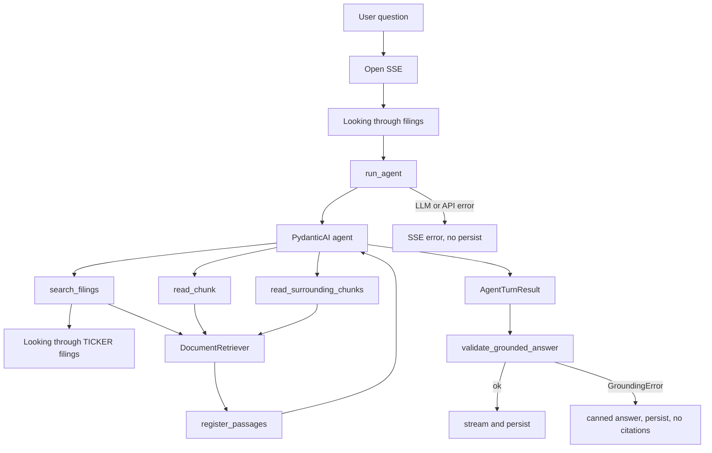

# Assistant

PydanticAI agent that answers analyst questions from retrieved SEC 10-K passages. It never writes SQL. Bounded tools call `DocumentRetriever`; structured output is a `GroundedAnswer` with citations.

Chat (`run_turn`) owns stream and persist. This package owns the LLM, tools, output schema, and citation check.

## Pipeline



1. **Turn setup.** Auth and thread checks stay HTTP (401/403/404). Then `run_turn` opens SSE, emits **Looking through filings**, builds `DocumentAgentDeps` (user id, thread id, `DocumentRetriever`, empty `seen_ids` / `seen_passages`, `status_queue`), and runs the agent **while** draining that queue into `data-status` parts.
2. **Agent loop.** PydanticAI agent (`output_type=GroundedAnswer`, instructions from `instructions.md`) may call tools until it returns structured output. Instructions: answer only from tool passages, cite every claim, set `insufficient_evidence` when the corpus cannot support an answer, no investment advice.
3. **Tools.** Implementations in `tools.py` go through `DocumentRetriever` (see [retrieval README](../retrieval/README.md)). Tool responses are formatted excerpts. Each hit and its neighbors are registered into `seen_ids` and `seen_passages` so later citations can be checked and streamed with filing metadata. `search_filings` also emits **Looking through filings** or **Looking through {TICKER} filings**.
4. **Result.** `run_agent` returns `AgentTurnResult`: the `GroundedAnswer` plus a usage dict (`requests`, `input_tokens`, `output_tokens`, `tool_calls`).
5. **Grounding.** `validate_grounded_answer` (no LLM) checks the answer against `seen_ids`. Failure raises `GroundingError` with a `code`. The orchestrator streams a canned user-facing answer for that code and persists it with no citations. It does not stream the ungrounded model text or validator wording. LLM/API failures yield an SSE `error` with user-facing copy and do not persist.
6. **Stream and persist.** On success, the orchestrator streams answer text then `data-citation` parts (ticker, form, year, page, section from `seen_passages`) and writes messages plus `message_citations`.

## Tools

`query` on `search_filings` is whatever the model passes, not automatically the raw user sentence. Optional `ticker`, `fiscal_years`, and `form` become `SearchFilters`.

| Tool | Retriever method | What it does |
| --- | --- | --- |
| `search_filings` | `DocumentRetriever.search` | Hybrid search; registers hits and neighbors. |
| `read_chunk` | `DocumentRetriever.passage_by_id` | Load one chunk by id. Missing id returns the empty-corpus string. |
| `read_surrounding_chunks` | `DocumentRetriever.surrounding_passages` | Neighbors around a chunk in the same filing. |

## Grounding

`validate_grounded_answer(answer, seen_ids)`:

- If `insufficient_evidence` is true, `citations` must be empty.
- Otherwise there must be at least one citation.
- Each `citation_index` must be unique.
- Every `chunk_id` must be in `seen_ids` (retrieved this turn, including neighbors).

Fabricated chunk ids fail this check. The LLM is not asked to police itself.

`GroundingError.code` is one of `missing_citations`, `unknown_chunk`, `duplicate_index`, or `insufficient_with_citations`. `grounding_user_answer` maps that code to the canned chat reply.

## Output

| Model | Role |
| --- | --- |
| `Citation` | `chunk_id`, `citation_index`, optional `excerpt` |
| `GroundedAnswer` | `answer`, `citations`, `insufficient_evidence` |
| `AgentTurnResult` | `answer` plus usage dict for storage |

## Settings

Chat-model knobs live in `app.config.settings` (env vars in `backend/.env`). Required, no code default:

| Env var | Setting | Example | Role |
| --- | --- | --- | --- |
| `OPENAI_CHAT_MODEL` | `openai_chat_model` | `gpt-4o-mini` | Chat model for the agent |
| `OPENAI_API_KEY` | `openai_api_key` | | API key for chat and (via retrieval) embeddings |

Search limits, RRF, neighbors, and embedding model: [retrieval README](../retrieval/README.md).

## Modules

```text
assistant/
├── agent.py          # PydanticAI Agent, tools, run_agent
├── tools.py          # execute_* + register_passages
├── deps.py           # DocumentAgentDeps
├── outputs.py        # Citation, GroundedAnswer, AgentTurnResult
├── grounding.py     # validate_grounded_answer, grounding_user_answer
├── instructions.md  # product contract for the model
└── __init__.py
```

Live smoke (OpenAI + Postgres, does not persist chat): from `backend/`, `uv run python -m scripts.smoke_agent`.
