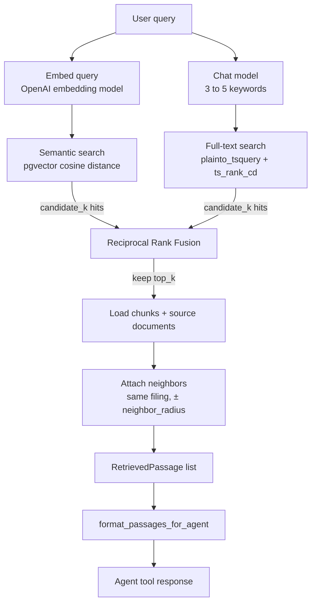

# Retrieval

Hybrid search over `document_chunks`: embed the query, run semantic (`pgvector`) and full-text (Postgres) searches in parallel, fuse the ranked lists with Reciprocal Rank Fusion (RRF), then hydrate the winning chunks (and optional neighbors) for the agent.

The PydanticAI agent never writes SQL. It calls bounded tools (`search_filings`, `read_chunk`, `read_surrounding_chunks`) that go through `DocumentRetriever`.

## Pipeline



1. **Embed.** `embed_query` turns the query into a vector with the configured OpenAI embedding model (same model and dimensions used at ingest).
2. **Semantic search.** Cosine distance (`<=>`) over `document_chunks.embedding`. Score is `1 - distance`. Chunks without an embedding are skipped. Limited to `RETRIEVAL_CANDIDATE_K`.
3. **Full-text search.** `extract_fts_keywords` asks `OPENAI_CHAT_MODEL` for 3–5 lexical terms (company, product, line item). Those terms go to `plainto_tsquery` against `search_vector`, ranked with `ts_rank_cd`. Limited to `RETRIEVAL_CANDIDATE_K`. If the model returns nothing, the original query is used. The embedding still uses the full query.
4. **Optional filters.** Both queries join `source_documents` and can filter on ticker, fiscal year(s), and form (`SearchFilters`).
5. **RRF fusion.** Each list contributes `1 / (k + rank)` per chunk (`rank` is 1-based). Chunks that appear in both lists score higher. The fused list is truncated to `RETRIEVAL_TOP_K`.
6. **Hydrate.** Load the selected chunks plus filing metadata (ticker, company, form, date, accession number, page, section).
7. **Neighbors.** For each hit, attach adjacent chunks in the same document (`chunk_index ± RETRIEVAL_NEIGHBOR_RADIUS`), skipping IDs already in the fused set so the same passage is not duplicated.
8. **Format.** Tool responses are truncated excerpts (`MAX_PASSAGE_EXCERPT_CHARS` per passage, `MAX_AGENT_OUTPUT_CHARS` total).

`search()` returns `[]` when neither query produces hits.

### Other entry points

| Method | Used by | What it does |
| --- | --- | --- |
| `DocumentRetriever.search` | `search_filings` | Full hybrid pipeline above. `include_neighbors=True` by default. |
| `DocumentRetriever.passage_by_id` | `read_chunk` | Load one chunk by id. `fusion_score=0`, no neighbors. |
| `DocumentRetriever.surrounding_passages` | `read_surrounding_chunks` | Neighbors around a chunk id in the same filing. |

## Default settings

All knobs live in `app.config.settings` (env vars in `backend/.env`). Retrieval-specific defaults:

| Env var | Setting | Default | Role |
| --- | --- | --- | --- |
| `RETRIEVAL_CANDIDATE_K` | `retrieval_candidate_k` | `50` | Max hits from **each** of semantic and full-text search before fusion. |
| `RETRIEVAL_TOP_K` | `retrieval_top_k` | `10` | How many fused passages `search()` returns. |
| `RETRIEVAL_RRF_K` | `retrieval_rrf_k` | `60` | Smoothing constant in `1 / (k + rank)`. Higher `k` flattens rank differences. |
| `RETRIEVAL_NEIGHBOR_RADIUS` | `retrieval_neighbor_radius` | `1` | Adjacent `chunk_index` window on either side. `0` disables neighbors. |
| `RETRIEVAL_FTS_CONFIG` | `retrieval_fts_config` | `english` | Postgres text-search config for `plainto_tsquery`. Must match ingest (`to_tsvector('english', chunk_text)`). |

Embedding settings used by this pipeline (required, no code default — values from `.env.example`):

| Env var | Example | Role |
| --- | --- | --- |
| `OPENAI_CHAT_MODEL` | `gpt-4o-mini` | Chat model used to pick 3–5 FTS keywords (same model as the document agent). |
| `OPENAI_EMBEDDING_MODEL` | `text-embedding-3-small` | Query embedding model. Must match ingest. |
| `OPENAI_EMBEDDING_DIMENSIONS` | `1536` | Vector size. Must match the `document_chunks.embedding` column. |

Formatting constants (code, not env):

| Constant | Value | Where |
| --- | --- | --- |
| `MAX_PASSAGE_EXCERPT_CHARS` | `800` | `formatting.py` — per-passage excerpt in tool output |
| `MAX_AGENT_OUTPUT_CHARS` | `12_000` | `formatting.py` — total tool-response cap |

Index used by semantic search (schema, not a runtime knob): HNSW on `embedding` with `vector_cosine_ops`, `m=16`, `ef_construction=64`.

## Modules

```text
retrieval/
├── retriever.py    # DocumentRetriever: embed → search → fuse → hydrate
├── keywords.py     # extract_fts_keywords for FTS
├── queries.py      # semantic_search, full_text_search, SearchFilters
├── fusion.py       # reciprocal_rank_fusion
├── formatting.py   # bounded text for agent tools
└── __init__.py
```
