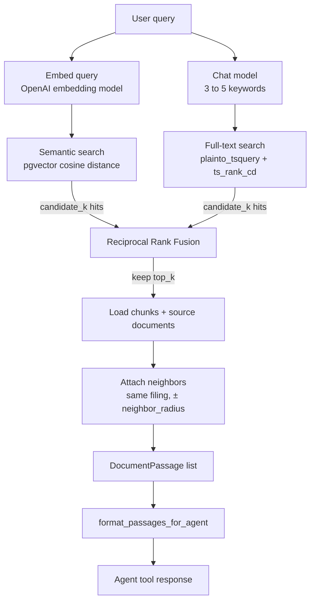

# Retrieval

Hybrid search over two corpora: 10-K filings (`document_chunks`) and one user's mail (`email_chunks`). Both embed the query, run a semantic (`pgvector`) and a full-text (Postgres) search, fuse the ranked lists with Reciprocal Rank Fusion (RRF), then hydrate the winning chunks for the agent.

The agents never write SQL. The document agent calls `search_filings`, `read_chunk`, and `read_surrounding_chunks`, which go through `DocumentRetriever`. The email agent calls `search_emails`, which goes through `EmailRetriever`.

## Shape

The package root holds what both corpora share. Each corpus subpackage supplies its table, filters, and passage load.

| Shared (root) | Documents | Email |
| --- | --- | --- |
| `HybridRetriever` in `base.py`: session handling, Langfuse span, embed, keywords, both searches, RRF, top k, then `_hydrate` | `DocumentRetriever` | `EmailRetriever` |
| `ChunkQueries` in `queries.py`: the semantic and full-text SQL over one chunk table | `DocumentQueries` | `EmailQueries` |
| `extract_fts_keywords` in `keywords.py`, `reciprocal_rank_fusion` in `fusion.py` | 10-K keyword prompt, neighbors | mail keyword prompt, owner scope on every query |

A subclass of `ChunkQueries` names its chunk alias, its `FROM` with joins, and `filter_clause`. A subclass of `HybridRetriever` sets `queries` and `keyword_prompt`, and implements `_hydrate`.

## Document pipeline


```mermaid
flowchart TD
    query[User query] --> embed[Embed query<br/>OpenAI embedding model]
    query --> keywords[Chat model<br/>3 to 5 keywords]
    keywords --> fts[Full-text search<br/>plainto_tsquery + ts_rank_cd]
    embed --> semantic[Semantic search<br/>pgvector cosine distance]

    semantic -->|"candidate_k hits"| rrf[Reciprocal Rank Fusion]
    fts -->|"candidate_k hits"| rrf

    rrf -->|"keep top_k"| hydrate[Load chunks + source documents]
    hydrate --> neighbors[Attach neighbors<br/>same filing, ± neighbor_radius]
    neighbors --> passages[DocumentPassage list]

    passages --> format[format_passages_for_agent]
    format --> agent[Agent tool response]
```

1. **Embed.** `embed_query` turns the query into a vector with the configured OpenAI embedding model (same model and dimensions used at ingest).
2. **Semantic search.** Cosine distance (`<=>`) over `document_chunks.embedding`. Score is `1 - distance`. Chunks without an embedding are skipped. Limited to `RETRIEVAL_CANDIDATE_K`.
3. **Full-text search.** `extract_fts_keywords` sends the retriever's `keyword_prompt` to `OPENAI_CHAT_MODEL`, which returns 3–5 lexical terms (company, product, line item). Those terms go to `plainto_tsquery` against `search_vector`, ranked with `ts_rank_cd`. Limited to `RETRIEVAL_CANDIDATE_K`. If the model returns nothing, the original query is used. The embedding still uses the full query.
4. **Optional filters.** Both queries join `source_documents` and can filter on ticker, fiscal year(s), and form (`DocumentSearchFilters`). All fields empty means no filter.
5. **RRF fusion.** Each list contributes `1 / (k + rank)` per chunk (`rank` is 1-based). Chunks that appear in both lists score higher. The fused list is truncated to `RETRIEVAL_TOP_K`.
6. **Hydrate.** Load the selected chunks plus filing metadata (ticker, company, form, date, accession number, page, section).
7. **Neighbors.** For each hit, attach adjacent chunks in the same document (`chunk_index ± RETRIEVAL_NEIGHBOR_RADIUS`), skipping IDs already in the fused set so the same passage is not duplicated.
8. **Format.** Tool responses are truncated excerpts (`MAX_PASSAGE_EXCERPT_CHARS` per passage, `MAX_AGENT_OUTPUT_CHARS` total).

`search()` returns `[]` when neither query produces hits.

### Other entry points

| Method | Used by | What it does |
| --- | --- | --- |
| `DocumentRetriever.search` | `search_filings` | Full hybrid pipeline above, with neighbors. |
| `DocumentRetriever.passage_by_id` | `read_chunk` | Load one chunk by id. `fusion_score=0`, no neighbors. |
| `DocumentRetriever.surrounding_passages` | `read_surrounding_chunks` | Neighbors around a chunk id in the same filing. |

## Email pipeline

`EmailRetriever.search` runs the same steps with three differences.

- **Scope.** Every query joins `emails` and `mailboxes` and requires `m.user_id = :user_id`, `m.id = ANY(:mailbox_ids)`, and `m.is_active`. The passage load repeats that scope, so a chunk outside it is dropped even if a search returned it. No active mailbox means `[]` without embedding.
- **Full-text input.** 1–4 keywords from the mail `keyword_prompt`: people and company names, subjects, products, services, order or invoice numbers. Dates, senders, and labels stay out of it because they are filters already.
- **Filters.** `EmailSearchFilters`: since and until as dates in `email_timezone`, label, sender (`ILIKE`, anywhere in the address), and mailbox (display name or address, case-insensitive).

Passages carry from, subject, sent date, and mailbox name. `format_email_passages` writes the tool text. There are no neighbors.

## Default settings

All knobs live in `app.config.settings` (env vars in `backend/.env`). Retrieval-specific defaults:

| Env var | Setting | Default | Role |
| --- | --- | --- | --- |
| `RETRIEVAL_CANDIDATE_K` | `retrieval_candidate_k` | `50` | Max hits from **each** of semantic and full-text search before fusion. |
| `RETRIEVAL_TOP_K` | `retrieval_top_k` | `10` | How many fused passages `search()` returns. |
| `RETRIEVAL_RRF_K` | `retrieval_rrf_k` | `60` | Smoothing constant in `1 / (k + rank)`. Higher `k` flattens rank differences. |
| `RETRIEVAL_NEIGHBOR_RADIUS` | `retrieval_neighbor_radius` | `1` | Adjacent `chunk_index` window on either side. `0` disables neighbors. |
| `RETRIEVAL_FTS_CONFIG` | `retrieval_fts_config` | `english` | Postgres text-search config for `plainto_tsquery`. Must match ingest (`to_tsvector('english', chunk_text)`). |

Embedding settings used by this pipeline (required, no code default — values from `.env.example`):

| Env var | Example | Role |
| --- | --- | --- |
| `OPENAI_CHAT_MODEL` | `gpt-4o-mini` | Chat model that picks FTS keywords for both corpora (same model as the agents). |
| `OPENAI_EMBEDDING_MODEL` | `text-embedding-3-small` | Query embedding model. Must match ingest. |
| `OPENAI_EMBEDDING_DIMENSIONS` | `1536` | Vector size. Must match the `document_chunks.embedding` column. |

Formatting constants (code, not env):

| Constant | Value | Where |
| --- | --- | --- |
| `MAX_PASSAGE_EXCERPT_CHARS` | `800` | `documents/formatting.py` — per-passage excerpt in tool output |
| `MAX_AGENT_OUTPUT_CHARS` | `12_000` | `documents/formatting.py` — total tool-response cap |

Index used by semantic search (schema, not a runtime knob): HNSW on `embedding` with `vector_cosine_ops`, `m=16`, `ef_construction=64`.

## Modules

```text
retrieval/
├── base.py            # HybridRetriever: embed → search → fuse → hydrate
├── queries.py         # ChunkQueries, RankedHit, FilterClause
├── keywords.py        # extract_fts_keywords(query, system_prompt=...)
├── fusion.py          # reciprocal_rank_fusion
├── documents/
│   ├── retriever.py   # DocumentRetriever, DocumentPassage, neighbors
│   ├── queries.py     # DocumentQueries, DocumentSearchFilters
│   └── formatting.py  # bounded text for the document tools
├── email/
│   ├── retriever.py   # EmailRetriever, EmailPassage, scoped load
│   ├── queries.py     # EmailQueries, EmailSearchFilters, owner scope
│   └── formatting.py  # text for search_emails
└── __init__.py
```
