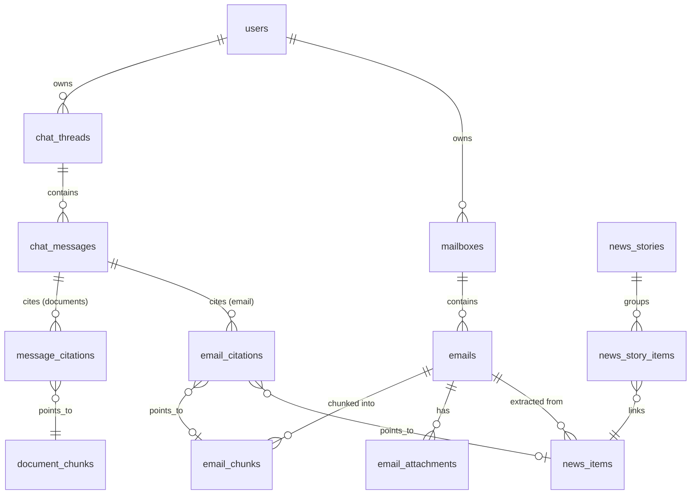

# Spec: Two-agent platform and Yahoo email chatbot

Status: draft · Owner: — · Last updated: 2026-09-24

## 1. Summary

The document copilot stays the same product. A second agent, **Email**, chats over the user's mailboxes, which are ingested, labeled, chunked, and embedded into their own tables. This slice connects one Yahoo mailbox. The schema is multi-mailbox from the start (§9), so adding Gmail or a work account later means adding a provider adapter and a `mailboxes` row, with no change to existing tables. Only one configured user can use the Email agent.

**In scope:** agent picker on `/`, per-agent threads, Yahoo IMAP ingest (CLI), labeling, invoice PDF storage and viewing, AI-newsletter item indexing, cross-source "big news" stories, email chat tools with citations, docs reorg.

**Out of scope (deferred):** Gmail, work email, and other providers (the schema supports them; only the Yahoo adapter is built), storing credentials or OAuth tokens in the database, full-history or re-embedding policy beyond the rule in §6.4, paying invoices, syncing deletes or moves from Yahoo, object storage for attachments, multi-mailbox or multi-user email.

## 2. Access control

- Mailboxes belong to a user (`mailboxes.user_id`).
- New setting `email_agent_owner_user_id` (UUID, optional) in `backend/app/config.py`. Ingest uses it to set the owner when it creates the Yahoo `mailboxes` row. When unset, ingest fails fast.
- A user has the Email agent if they own at least one active mailbox. With no mailboxes, the agent is off for everyone and the API still boots.
- All email queries (search, news, invoices, attachments) are scoped to the current user's mailboxes. This keeps the rule correct once more mailboxes, or more users, exist.
- Every email-related route returns **403** to a user with no mailbox. This covers:
  - thread list and create with `agent=email`
  - messages posted to an email thread
  - invoice list and detail
  - attachment download
- `GET /me` (or the existing current-user endpoint) returns `agents: ["documents"]` or `["documents", "email"]`. The frontend hides the Email card on `/` when `email` is absent.
- Tests: the owner gets 200 and a non-owner gets 403 on each route above, and the document routes are unaffected.

## 3. Docs

Every folder carries a two-digit prefix in the order it was started. Setup guides came first (`00`), then the copilot, then its evaluation, then this agent. A folder keeps growing after it is numbered; the number only says when it began. The next agent takes `04-`.

```text
docs/
├── README.md                  # map of everything below
├── 00-guides/                 # moved from docs/guides/: backend, frontend, supabase setup
├── 01-document-copilot/
│   ├── architecture.md        # moved from docs/architecture.md
│   └── client-brief.md        # moved from docs/client-brief.md
├── 02-evaluation/
│   └── evals-todo.md          # moved from docs/evals-todo.md
└── 03-email/
    ├── spec.md                # this file, moved from docs/email-agent-spec.md
    ├── todo.md                # build guide, gitignored
    └── overview.md            # new, written when the email work is done
```

- Add a new `docs/README.md` as the map, with sections for platform, guides, document copilot, evaluation, and email. The platform section states the numbering rule.
- Add a new `docs/03-email/overview.md` covering:
  - labels
  - AI-newsletter item indexing and story matching
  - the ingest cap and `--since`
  - idempotency
  - owner-only access
  - attachment storage and the 10 MB skip
  - what is deferred (Gmail, full-history policy, invoice payment, Supabase Storage move)
- Fix links in the moved files, `README.md`, `AGENTS.md`, and `backend/README.md` (links into `docs/guides/`).

## 4. UI

### 4.1 Routes

| Route | Behavior |
|---|---|
| `/` | Agent picker. One card per agent the user can open. Documents is always there. Email is there only when `/me` includes `email`. Choosing a card goes to that agent's route. |
| `/documents`, `/documents/:threadId` | Document copilot |
| `/email`, `/email/:threadId` | Email agent (owner only; others redirect to `/`) |
| `/email/invoices/:emailId` | Invoice detail |
| `/chat` | Redirect to `/documents` |
| `/chat/:threadId` | Redirect to `/documents/:threadId` |

### 4.2 Sidebar

- The sidebar header names the current agent and links back to `/`, so the picker stays reachable after a choice.
- Email is shown only to the owner. A non-owner who opens `/email` returns to the picker.
- Each agent has its own thread list, empty state, and new-chat action.
- The Email sidebar has an **Invoices** section above the thread list. It lists emails labeled `invoice` (from, subject, date), newest first.
- Main files touched: `frontend/src/App.tsx` and `frontend/src/components/chat/ThreadSidebar.tsx`.

### 4.3 Chat view

- Streaming, citations, and the document empty state are unchanged.
- The email view swaps the empty-state copy.
- Email citations show from, subject, and date.
- Newsletter citations show title, source, edition date, and link.

### 4.4 Invoice detail

- Shows from, subject, date, and the saved body.
- Lists the email's PDF attachments. Each one opens in an embedded viewer served from `GET /email/attachments/:id` (`Content-Type: application/pdf`).
- A skipped attachment is listed with its filename and "not stored (over 10 MB)".
- There is no pay action.

## 5. Chat dispatch

- `chat_threads.agent` is `text not null default 'documents'` with a check constraint `in ('documents','email')`. Existing threads stay on the copilot.
- Thread list and create take `agent` and filter by it.
- `backend/app/chat/orchestrator.py` branches on `thread.agent`. The document path is unchanged.
- The email path is a sibling PydanticAI agent in `backend/app/email_assistant/` (instructions, tools, grounding). It uses the same configured chat model as the copilot.
- Email citations are stored in a new `email_citations` table, so `message_citations.chunk_id` keeps its foreign key to `document_chunks`.

## 6. Yahoo ingest

### 6.1 Config

- Add `yahoo_email` and `yahoo_app_password` (optional at API startup). The ingest command exits immediately with a clear error if either is missing.
- Yahoo requires an app password.
- Credentials stay in config in this slice, keyed by mailbox. Later accounts get their own settings (for example `work_imap_*`), or OAuth tokens in a secret store for Gmail. Passwords and tokens are never stored in `mailboxes`.
- Also add:
  - `ai_newsletter_domains` (maps domain to `tldr` or `alpha_signal`)
  - `news_match_window_hours` (default 48)
  - `news_match_threshold` (default 0.80)
  - `attachment_max_bytes` (default 10 MB)

### 6.2 Connection and CLI

- **Provider adapters.** Ingest is split into a provider adapter and a shared pipeline:
  - The adapter fetches messages and returns a provider-neutral `ParsedMessage` (Message-ID, provider message id, folder, headers, body, attachments).
  - The pipeline (§6.3–6.5) does everything else and never knows the provider.
  - This slice builds `YahooImapAdapter` only. Gmail (API) or a work IMAP or Exchange account would be new adapters.
- On first run, ingest upserts a `mailboxes` row: provider `yahoo`, the address from `yahoo_email`, owner from `email_agent_owner_user_id`.
- IMAP SSL to `imap.mail.yahoo.com:993` via stdlib `imaplib`. No new dependency.
- Run with `uv run python -m ingest.email_yahoo` from `backend/`.
  - `--limit N`: default 5; `0` means no cap.
  - `--since YYYY-MM-DD`: optional. It filters first, then `--limit` caps, newest first.
- The command reads INBOX only.
- It prints a summary: fetched, skipped (already embedded), new, re-embedded, labels by count, attachments saved or skipped, news items, and stories rebuilt.

### 6.3 Parsing

- **Message-ID:** RFC `Message-ID` header with angle brackets stripped and whitespace trimmed. If the header is missing, a message cannot be deduplicated reliably, so it is skipped and logged.
- **Body:** the `text/plain` part if present; otherwise the `text/html` part with tags stripped by `html.parser`. Whitespace is normalized.
- **Stored fields:** subject, from address, to addresses, sent time (UTC).
- `content_hash` is SHA-256 of the normalized body plus subject.
- **Attachments:** every attachment with `content_type = application/pdf` or a `.pdf` filename is saved, whatever the email's label. A PDF over `attachment_max_bytes` gets a row with `content` null, `size_bytes` set, and `skipped_reason = 'too_large'`.

### 6.4 Idempotency

A message is skipped when all four hold:
- the same `mailbox_id` + `message_id` exists,
- `content_hash` matches,
- `embedding_model` matches current settings,
- `embedding_dimensions` matches current settings.

If the model or dimensions changed, the message's chunks are re-embedded and its news items are rebuilt (extraction, embeddings, and stories in its window). Raising `--limit` never re-embeds stored messages.

Uniqueness is per mailbox, not global. The same email CC'd to both a personal and a work address is stored once per mailbox, because each copy has its own labels and folder, and access rules apply to it separately.

### 6.5 Pipeline per new message

1. Parse the headers, body, and PDF attachments.
2. Label it (§7). The classifier sees the attachment filenames.
3. Upsert the `emails` row, and write the chunks and embeddings. Every email gets chunks, including AI newsletters. Chunking reuses the document chunker's settings.
4. Write the `email_attachments` rows.
5. If the label is `ai_newsletter`, extract and embed the news items (§8).

Steps 3–5 for one message run in one transaction. After the run, rebuild stories for every window touched by new or re-embedded newsletters.

## 7. Labels

1. **Sender-domain rule first.** If the sender domain is in `ai_newsletter_domains`, the label is `ai_newsletter` and `newsletter_source` is set to `tldr` or `alpha_signal`. The message does not go through the classifier.
2. **Everything else** gets one structured LLM call (same chat model) that returns exactly one label:

| Label | Meaning |
|---|---|
| `needs_reply` | A person expects an answer |
| `promotional` | Marketing, sales, or a newsletter whose point is to sell |
| `newsletter` | Informational mailing that is not an AI digest and not a sales pitch |
| `invoice` | A bill or payment request, including a PDF invoice attached |
| `fyi` | Personal or transactional mail with no reply needed, not a bill |

- The classifier input is from, subject, attachment filenames, and the body truncated to a fixed length.
- An output outside the enum is retried once. If it is still invalid, the email is labeled `fyi` and logged.
- `ai_newsletter` names the kind of email. The source is stored separately, so several TLDR editions still count as one side of a pair.

## 8. AI newsletter items and stories

### 8.1 Extraction

- One structured LLM call per new or re-embedded `ai_newsletter`. It returns a list of `{title, blurb, url}` in order. Sponsor blocks are dropped.
- Each item becomes a `news_items` row with:
  - source
  - `edition_date` (the date of `sent_at` in Europe/Berlin)
  - position
  - the embedding of `title + "\n" + blurb`, with the same model and dimensions as other mail
- Re-extraction deletes the email's old items first.

### 8.2 Matching

- **Candidates:** items whose `edition_date` falls within `news_match_window_hours` of the new newsletter's edition.
- **Edges:** only across sources (`tldr` ↔ `alpha_signal`), when cosine similarity is at least `news_match_threshold`. Two items from the same source are never compared.
- **Stories:** every item ends in a story. Connected components of the cross-source edges are one story. An item with no edge is its own story.
  - `first_seen` and `last_seen` are the min and max edition dates.
  - `is_big` is true only when both `tldr` and `alpha_signal` are in the story. A one-source story has `is_big` false.
  - Two items from the same source stay separate stories. They are never merged just because both are TLDR or both are Alpha Signal.
- **Rebuild:** delete and recreate the stories whose items fall in the affected window. This lets a morning TLDR attach to the previous evening's Alpha Signal. Citations point to `news_items`, never to stories, so the rebuild never breaks a citation.
- **Tuning aid:** after matching, the CLI logs the top 10 cross-source similarity scores in the window, including those below the threshold.

### 8.3 Topic search

Topic search does not use stories. It embeds the question and ranks `news_items`.

## 9. Data model

These are new tables. Document tables are unchanged apart from `chat_threads.agent`.



### `chat_threads` (changed)

| Column | Notes |
|---|---|
| `agent` | new; `documents` \| `email`, default `documents` |

### `mailboxes`

One row per connected account.

| Column | Notes |
|---|---|
| `id` | uuid |
| `user_id` | FK to `users` (owner) |
| `provider` | text, check in `yahoo`, `gmail`, `imap`; only `yahoo` is used now |
| `address` | text, the account's email address |
| `display_name` | text, e.g. "Personal", "Work" |
| `is_active` | bool, default true; lets an account be paused without deleting its mail |
| `last_synced_at` | timestamptz, nullable |
| `sync_cursor` | jsonb, nullable; provider-specific resume point (IMAP UIDVALIDITY and last UID, or a Gmail historyId) |
| `created_at` | timestamp |

Unique: `(provider, address)`. Credentials are not stored here (§6.1).

### `emails`

| Column | Notes |
|---|---|
| `mailbox_id` | FK to `mailboxes`, cascade |
| `message_id` | text, the RFC Message-ID; unique together with `mailbox_id` |
| `provider_message_id` | text, nullable; IMAP UID or Gmail message id, for re-fetching |
| `folder` | text, e.g. `INBOX` (a Gmail label later) |
| `subject` | text |
| `from_address` | text |
| `to_addresses` | text[] |
| `sent_at` | timestamptz |
| `body` | text |
| `label` | text, check in the six labels |
| `newsletter_source` | null, `tldr`, or `alpha_signal` |
| `content_hash` | text |
| `embedding_model` | text |
| `embedding_dimensions` | int |
| `created_at`, `updated_at` | timestamps |

Indexes: `(mailbox_id, label, sent_at desc)` and `(from_address)`.

`emails` has no `provider` column, because the provider belongs to the mailbox. The child tables (`email_chunks`, `email_attachments`, `news_items`) reach the mailbox through `email_id`, so they need no change when accounts are added.

### `email_chunks`

| Column | Notes |
|---|---|
| `email_id` | FK cascade |
| `chunk_index` | int |
| `content` | text |
| `embedding` | vector(current dims) |
| `tsv` | generated tsvector |

Indexes: GIN on `tsv`, and a vector index matching the one on `document_chunks`.

### `email_attachments`

| Column | Notes |
|---|---|
| `email_id` | FK cascade |
| `filename` | text |
| `content_type` | text |
| `size_bytes` | int |
| `content` | bytea, nullable |
| `skipped_reason` | text, nullable |

### `news_items`

| Column | Notes |
|---|---|
| `email_id` | FK cascade |
| `source` | text |
| `edition_date` | date |
| `position` | int |
| `title` | text |
| `blurb` | text |
| `url` | text |
| `embedding` | vector |
| `embedding_model` | text |
| `embedding_dimensions` | int |

### `news_stories`

| Column | Notes |
|---|---|
| `first_seen` | date |
| `last_seen` | date |
| `is_big` | bool |

### `news_story_items`

| Column | Notes |
|---|---|
| `story_id` | FK cascade |
| `item_id` | FK cascade |

Primary key: `(story_id, item_id)`.

### `email_citations`

| Column | Notes |
|---|---|
| `message_id` | FK to `chat_messages` |
| `email_chunk_id` | nullable FK |
| `news_item_id` | nullable FK |
| `citation_index` | int |
| `excerpt` | text |

Check constraint: exactly one of `email_chunk_id` and `news_item_id` is set.

### Attachment storage note

Bytes live in Postgres as bytea and are stored out of line (TOAST). A year of personal invoices is small. If backups become painful, keep the rows, move the bytes to Supabase Storage with an object key on the row, and serve them via short-lived signed URLs. A data lake is the wrong tool here.

## 10. Email chat tools

| Tool | Behavior |
|---|---|
| `search_emails(query, since?, until?, label?, sender?, mailbox?)` | Hybrid search over `email_chunks` (pgvector plus full-text, fused with RRF, same as the copilot), joined to `emails` for filters and always scoped to the user's mailboxes. `mailbox` matches a mailbox's display name or address ("in my work email"); it is omitted when the question doesn't name an account. Returns chunk id, excerpt, from, subject, date, and mailbox name. |
| `list_big_news(since?, until?)` | Stories with `is_big` whose date range overlaps the given range. Returns title, blurb, both sources, dates, and links per story, citing its items. |
| `search_news(query, since?, until?, big_only?)` | Vector search over `news_items`. `big_only` restricts results to items in a big story. |

- **Instructions:**
  - Resolve relative dates ("last week") in Europe/Berlin, using the current date from the prompt.
  - Use `search_emails` for ordinary mail questions and the news tools for newsletter story questions.
  - Cite every claim.
- **Grounding:**
  - Citations reference only ids returned by tools in the current turn.
  - Unknown ids are dropped, mirroring the copilot's grounding.

## 11. Tests

Backend tests use pytest and run with `uv run pytest -m "not integration"` from `backend/`. IMAP, OpenAI, and the database are mocked. They cover:

- Message-ID parsing (brackets, whitespace, missing header)
- Body extraction (plain, HTML-only)
- The skip rule (all four match → skip; changing any one → reprocess)
- Label parsing for all six labels, including `invoice`, and the invalid-output fallback
- Sender-domain assignment to `ai_newsletter` with the right source
- Item extraction from mocked model output, with sponsors dropped
- The pair rule:
  - a TLDR and an Alpha Signal item above the threshold form one story with `is_big` true
  - two TLDR items never pair; each is its own story with `is_big` false
  - a pair below the threshold does not merge; each item is its own story with `is_big` false
  - items outside the window don't pair
- Attachment save: every PDF is stored; one over 10 MB gets a row with `skipped_reason`
- Thread create and list by agent
- Orchestrator dispatch by agent
- Owner-only access: 403 for users without a mailbox, and the agents list in `/me`
- Mailbox scoping:
  - the same Message-ID in two mailboxes is stored twice and skipped per mailbox;
  - search never returns another user's mailbox;
  - the `mailbox` filter narrows results.
- The pipeline runs against a fake adapter, so it has no Yahoo-specific logic
- `email_citations` check constraint

Frontend checks:
- `pnpm tsc --noEmit` and `pnpm lint` pass.
- A browser pass covering:
  - the picker on `/`, including that a non-owner sees no Email card, and the sidebar link back to `/`
  - separate thread lists per agent
  - an email question that lists big news
  - an email question that searches a topic
  - an invoice opened with its stored PDF
  - `/chat/:id` redirecting correctly

First real check: run ingest with `--limit` just high enough to include one TLDR and one Alpha Signal from the same day, and confirm at least one big story.

## 12. Subtasks

The critical path is **2 → 5 → 6 → 7 → 8 → 9**. Tasks 1, 3, 4, and 10 can run alongside it.

**1. Docs reorg**
- Depends on: none.
- Scope: §3 moves, `docs/README.md`, link fixes.
- Done when: no broken relative links (checked by grep or a link checker).

**2. Schema and migrations**
- Depends on: none.
- Scope: `chat_threads.agent`, `mailboxes`, and every table, index, and constraint in §9.
- Done when:
  - the migration applies and rolls back cleanly;
  - existing threads read as `documents`;
  - the `email_citations` constraint test passes.

**3. Thread plumbing and access control**
- Depends on: 2.
- Scope:
  - thread list and create by agent;
  - orchestrator branch with a stub email agent;
  - `email_agent_owner_user_id` and the agents list in `/me`;
  - the 403 checks in §2.
- Done when: the dispatch, thread, and access tests pass.

**4. Frontend picker**
- Depends on: 3.
- Scope:
  - the routes and redirects in §4.1;
  - the agent picker on `/`;
  - per-agent thread lists and empty states;
  - Email hidden for non-owners.
- Done when: `tsc` and lint pass, and the browser pass covers the picker and redirects.

**5. Yahoo ingest core**
- Depends on: 2.
- Scope:
  - config and CLI flags;
  - the adapter interface and `ParsedMessage`, `YahooImapAdapter`, and the mailbox upsert;
  - IMAP fetch and parsing;
  - the idempotency rule;
  - chunking, embedding, and PDF attachments;
  - `label` set to a placeholder until task 6 lands.
- Done when:
  - the parsing, skip-rule, and attachment tests pass;
  - a real `--limit 5` run stores 5 messages;
  - a second run skips all 5.

**6. Labeling**
- Depends on: 5 (can be built in parallel behind an interface).
- Scope: §7.
- Done when: the label tests pass and the real-run summary shows sensible labels.

**7. Newsletter item extraction**
- Depends on: 5, 6.
- Scope: §8.1.
- Done when: the extraction tests pass and a real TLDR edition yields items without sponsor blocks.

**8. Story clustering**
- Depends on: 7.
- Scope: §8.2, including the score log.
- Done when:
  - the pair-rule tests pass;
  - a real same-day pair produces at least one big story;
  - the threshold is reviewed against the logged scores.

**9a. Email agent: mail search**
- Depends on: 3, 5.
- Scope: `search_emails`, the email agent's instructions and grounding, and writing `email_citations`.
- Done when: a mocked end-to-end chat test stores citations, and real questions return cited answers.

**9b. Email agent: news tools**
- Depends on: 8, 9a.
- Scope: `list_big_news`, `search_news`, and newsletter citations.
- Done when: the questions "big news last week" and "news about robots last month" answer with item citations.

**10. Email UI**
- Depends on: 4, 5.
- Scope:
  - email citation fields;
  - the invoice list and detail view;
  - the attachment endpoint;
  - the skipped-attachment display.
- Done when: an invoice opens with its stored PDF and no call to Yahoo.

**11. Overview doc and end-to-end check**
- Depends on: all.
- Scope:
  - `docs/03-email/overview.md`;
  - the full browser pass in §11;
  - the first real check with both newsletter sources.
- Done when: all the checks in §11 pass.

## 13. Open items

- Tune `news_match_threshold` once scores from the first real pair are logged.
- Confirm the exact TLDR and Alpha Signal sender domains for `ai_newsletter_domains`.
- Keep `mailboxes.sync_cursor`, `is_active`, `last_synced_at`, `emails.provider_message_id`, and the `mailbox` filter on `search_emails`. Ingest writes `last_synced_at`, `sync_cursor` (UIDVALIDITY and highest UID), and the IMAP UID as `provider_message_id`. A later run still uses `--limit` and `--since`; the cursor is stored so a resume can use it later.
- `is_big` stays. It is false on a one-source story and true only when both sources are in the story. `list_big_news` and `search_news(big_only)` use it.
- Store every PDF at or under `attachment_max_bytes`, whatever the label. A larger file is recorded with `skipped_reason='too_large'` and no bytes.
- `Europe/Berlin` is hardcoded in §8.1 and §10. Make it one setting.
- Once a second mailbox exists:
  - The same newsletter edition received in two mailboxes produces duplicate news items. Dedupe by source + edition date + position before matching, or at query time.
  - The UI should show which mailbox a citation or invoice came from, once there is more than one.
