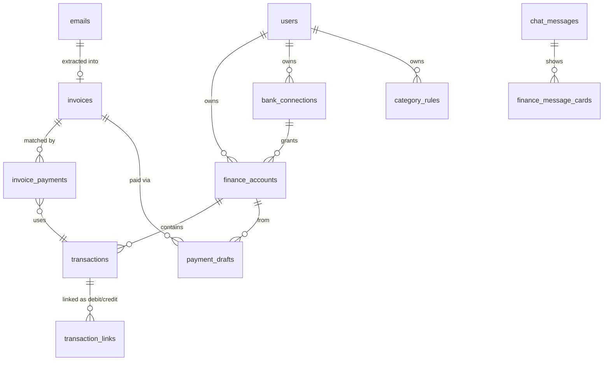

# Spec: Finance agent

Status: draft · Owner: — · Last updated: 2026-10-06

## 1. Summary

A third agent, **Finance**, works over the user's invoices and bank transactions. Invoices come from mail the Email agent already ingests and labels `invoice`. Transactions come live from two German bank accounts (N26, ING) and PayPal. Finance:

- extracts payment data (payee, IBAN, amount, reference, due date) from every invoice,
- keeps one ledger of all transactions, paid and received, across the three accounts,
- links each PayPal payment to the bank debit that funded it, and detects transfers between the user's own accounts,
- puts every expense into a category automatically, and learns from the user's corrections,
- marks invoices paid by matching them to transactions, or by hand,
- prepares payments for open invoices. The user approves each one and pays it in their banking app.

The Finance chat answers with database tools, not text retrieval: "what do I still need to pay", "travel spend in September", "pay them all".

**In scope:** Finance agent (picker card, threads, chat tools), invoice extraction, invoices dashboard and detail, Enable Banking connection for N26 and ING, PayPal sync, transactions ledger, PayPal ↔ bank linking, internal transfer detection, categorization with user rules, spending view, invoice ↔ transaction matching, payment drafts with an EPC QR code ("GiroCode"), scheduled email ingest and bank sync on Railway.

**Out of scope (deferred):** sending payments through an API (payment initiation), partial or combined payments (one transaction covering several invoices, or the other way round), foreign-currency invoices, budgets and alerts, multi-user finance, PDF text search over invoices.

**Assumption:** invoices are paid by SEPA bank transfer. An invoice without a valid IBAN and amount is `needs_info`, and the user fills it in.

## 2. Access control

- New setting `finance_agent_owner_user_id` (UUID, optional). Only that user has the Finance agent. When it is unset, Finance is off for everyone and the API still boots.
- `GET /me` adds `finance` to `agents` for the owner.
- Every finance route returns **403** for anyone else: threads with `agent=finance`, invoices, transactions, accounts, bank connect and callback, payment drafts, spending.
- Invoices are built from emails in mailboxes the user owns. Accounts and transactions belong to the user (`finance_accounts.user_id`).
- Tests: the owner gets 200, and a non-owner gets 403, on each route above.

## 3. Docs

- `docs/05-finance/spec.md` (this file), `todo.md` (build guide, gitignored), `overview.md` (written when the build is done).
- `docs/README.md` gets a `05-finance` section.
- `docs/03-email/spec.md` §4.4 notes that invoice detail moved to Finance.
- A new evaluation plan, `docs/02-evaluation/plans/004-…`, covers invoice extraction and categorization accuracy (§16).

## 4. UI

### 4.1 Routes

| Route | Behavior |
|---|---|
| `/finance`, `/finance/:threadId` | Finance chat (owner only; others redirect to `/`) |
| `/finance/invoices` | Invoices dashboard (§4.3) |
| `/finance/invoices/:invoiceId` | Invoice detail: PDF beside the extracted payment data (§4.4) |
| `/finance/transactions` | Transactions ledger with category editing (§4.5) |
| `/finance/spending` | Spending by category and month (§4.6) |
| `/finance/accounts` | Connected accounts, sync status, connect and reconnect (§4.7) |
| `/finance/accounts/callback` | Return point from the bank's consent page |

### 4.2 Sidebar

- Header names the agent and links back to `/`, as for the other agents.
- Links above the thread list: Invoices (with a badge for the number of open invoices), Transactions, Spending, Accounts.
- A warning dot on Accounts when a connection is expired or expires within 14 days.
- The Email sidebar has no Invoices section. Invoices live only in Finance.

### 4.3 Invoices dashboard

- Table: payee, invoice number, amount, invoice date, due date, status, matched transaction (if any).
- Filters: status (`open`, `needs_info`, `paid`, all), date range, payee text. Default is `open` + `needs_info`, sorted by due date with overdue invoices first.
- Row checkboxes. Actions on the selection:
  - **Mark paid**: sets `paid` with `paid_source = manual`.
  - **Pay selected**: asks which account to pay from, then creates payment drafts and opens the payment review (§4.8). Disabled for rows that are not `open`.
- A **Suggested match** chip on a row whose match is uncertain (§10). Clicking it shows the transaction with **Confirm** and **Reject**.

### 4.4 Invoice detail

- Left: the stored PDF (or the email body when the invoice has no PDF).
- Right: the extracted fields, editable. Saving an edit sets `fields_source = manual`, and re-checks the IBAN and the status.
- The source email (from, subject, date), the status, the matched transaction, and Pay / Mark paid actions.

### 4.5 Transactions

- Table: date, account, counterparty, reference, amount (credits and debits shown differently), category.
- Filters: account, category, date range, text, debits only or credits only.
- The category cell is a dropdown. Changing it sets `category_source = manual` and asks "Always use *X* for *counterparty*?". Yes creates a rule (§9.2).
- PayPal-funding debits and internal transfers show a link icon that points to the other side.

### 4.6 Spending

- Month × category table of debits, excluding `Transfer`, with totals. A horizontal bar per category for the selected month, drawn with plain CSS (no chart library).
- Clicking a cell opens Transactions with those filters applied.

### 4.7 Accounts

- One row per account: name, IBAN (masked), provider, last sync, consent valid until, status (`active`, `expiring`, `expired`, `error`).
- **Connect bank** (pick N26 or ING) and **Reconnect** start the consent flow (§6.2).
- **Sync now** runs the sync for that account (rate limit applies; §6.4).

### 4.8 Payment review

Used both from the dashboard and from chat cards.

- One card per draft: payee, IBAN, BIC (if any), amount, reference, from-account. The invoice PDF opens in a side panel.
- **Approve** shows the EPC QR code for that draft and buttons to copy IBAN, amount and reference. The user scans the code in the banking app and confirms there.
- **Cancel** discards the draft.
- For a batch, the review steps through the cards one by one ("2 of 5"). One QR code holds one transfer.

### 4.9 Chat view

- Answers stream as in the other agents.
- A Finance reply can carry **cards** (§13.2): an invoice list, a transaction list, a spending summary, or payment drafts. Cards render from the ids they reference and fetch current data, so a card shows today's status, not the status when the answer was written.

## 5. Invoice extraction

### 5.1 When

- In the email ingest pipeline, after an email is labeled `invoice` (one more step after §6.5 step 5 of the email spec), in the same transaction.
- A backfill CLI for invoices already stored: `uv run python -m ingest.invoices [--since YYYY-MM-DD] [--force]`. Without `--force`, emails that already have an `invoices` row are skipped.
- Re-extraction never overwrites an invoice with `fields_source = manual`.

### 5.2 Call

- One structured LLM call per invoice email. The input is from, subject, the body, and every stored PDF attachment, passed as PDF file input to the model, so no PDF parsing library is needed.
- Settings: `invoice_extraction_model` and `invoice_extraction_reasoning_effort`, both optional. They follow the same pattern as `news_extraction_*`: when unset, the call uses `openai_chat_model` at its default effort.
- Output fields, each nullable: `payee_name`, `iban`, `bic`, `amount`, `currency`, `invoice_number`, `payment_reference`, `invoice_date`, `due_date`.
- The instructions ask for the reference the invoice asks the payer to use. If the invoice gives none, the reference falls back to the invoice number.
- A failed call is retried once. If it fails again, the invoice is stored with every field null, status `needs_info`, and the failure is logged.

### 5.3 Validation and status

- IBAN: spaces removed, uppercased, length checked for the country, mod-97 checked (stdlib, a few lines). An invalid IBAN is stored with `iban_valid = false`.
- `amount > 0` and `currency = 'EUR'`.
- Status after extraction:
  - `open` when `iban_valid`, amount, currency EUR and payee name are all present;
  - `needs_info` otherwise.
- `paid` is set only by matching (§10) or by the user.

## 6. Bank connections (Enable Banking)

### 6.1 Provider

- [Enable Banking](https://enablebanking.com) is a PSD2 aggregator with self-serve signup. Its restricted production mode lets an app connect the developer's own accounts for free. (GoCardless Bank Account Data no longer takes new signups.)
- It is a REST API. Each request is authorized with a JWT signed RS256 by the app's private key.
- Settings: `enable_banking_app_id`, `enable_banking_private_key` (PEM), `enable_banking_redirect_url`. They are optional at API startup. Connect and sync fail fast with a clear error when any one is missing.
- Dependencies: `httpx` (already present), and `pyjwt` with `cryptography` to sign the JWT. Both are already in the lock file through `supabase`. Pin them as direct dependencies with the justification in the commit message.

### 6.2 Consent flow

1. The user clicks Connect for N26 or ING. The backend calls `POST /auth` with the bank (`name`, `country = DE`), `valid_until` (the bank's maximum, usually 180 days), the redirect URL, and a random `state` that is stored in `bank_connections` with status `pending`.
2. The frontend redirects to the returned bank URL. The user logs in and approves on the bank's side.
3. The bank redirects to `/finance/accounts/callback?code=…&state=…`. The frontend posts both to the backend.
4. The backend checks `state`, calls `POST /sessions` with the code, stores `session_id` and `valid_until` on the connection with status `active`, and upserts one `finance_accounts` row for each account returned (provider account uid, IBAN, name, currency).
5. It runs a first sync for 90 days back.

`session_id` is stored in the database. It is useless without the app's private key, which lives only in settings.

### 6.3 Sync

- `GET /accounts/{uid}/transactions` from `date_from`, following `continuation_key` until it is exhausted.
- Only booked transactions are stored. Pending entries are ignored and arrive once they are booked.
- `date_from` is the last synced booking date minus 7 days. The overlap absorbs late bookings, and the unique key absorbs duplicates.
- **External id:** the bank's `entry_reference` or `transaction_id` when present. Otherwise a SHA-256 of account uid, booking date, amount, counterparty IBAN, remittance text and ordinal within that day. The ordinal keeps two identical coffees on the same day as two rows.
- Mapped fields: booking date, value date, signed amount (debits negative), currency, counterparty name and IBAN, remittance text, bank transaction code, MCC when present. The raw JSON is kept in `raw`.
- After each sync: transfer detection (§8), categorization (§9), invoice matching (§10).

### 6.4 Limits and expiry

- PSD2 allows about 4 unattended account requests per day per account. The scheduled sync runs 3 times a day (§12). **Sync now** in the UI runs with the user present, which banks count separately. The backend still refuses a manual sync within 10 minutes of the previous one.
- A connection is `expiring` within 14 days of `valid_until`, and `expired` after it or when the API answers that the session is invalid. Expired connections are skipped by the scheduled sync and shown in the UI with **Reconnect** (§6.2 again; accounts are matched by provider uid or IBAN, so history stays).

## 7. PayPal

1. **First choice:** connect PayPal through Enable Banking as a third bank, if PayPal (Europe) is listed for Germany. Then it is a normal connection and §6 applies unchanged.
2. **Fallback:** the PayPal Transaction Search API (`GET /v1/reporting/transactions`). It needs a PayPal Business account (the upgrade is free) and a REST app with Transaction Search enabled.
   - Settings: `paypal_client_id`, `paypal_client_secret`. OAuth client credentials. No user consent flow and no expiry.
   - Queries are limited to 31 days each. Newly made transactions can take hours to appear.
   - It creates one `finance_accounts` row with provider `paypal_api`, upserted on first sync.
   - Mapped fields: as in §6.3, with the merchant as counterparty and the PayPal transaction id as external id.

Which path is used is decided in subtask 1 (§17) and noted in §18.

## 8. Transfers and PayPal linking

Money moving between the user's own accounts is not spending. Both sides get category `Transfer` and are linked in `transaction_links`.

- **Internal transfer:** a debit whose counterparty IBAN is one of the user's own accounts, and the credit on that account with the opposite amount within 5 days. If the credit is never found (for example, the other account isn't connected), the debit is still `Transfer`.
- **PayPal funding:** a bank debit whose counterparty name normalizes to contain `paypal`, paired with the PayPal transaction of the same amount booked 0–5 days *before* it.
  - If more than one PayPal transaction fits, the merchant name in the bank's remittance text (PayPal usually writes "Ihr Einkauf bei <merchant>") breaks the tie. If still ambiguous, nothing is linked and the bank debit stays uncategorized for the user.
  - Links are one to one.
  - The bank debit becomes `Transfer`. The PayPal purchase keeps its own category, so the spending counts once.
- PayPal's own funding entries in its ledger ("from bank account") are also `Transfer`.
- Link kinds: `internal_transfer`, `paypal_funding`. Each link records `source`: `auto` or `manual`.

## 9. Categorization

### 9.1 Categories

`General`, `Groceries`, `Dining`, `Shopping`, `Transport`, `Travel`, `Housing`, `Utilities`, `Subscriptions`, `Health`, `Insurance`, `Income`, `Transfer`.

The list is a Python enum and a check constraint. Adding one is a migration.

### 9.2 Order

Each new transaction gets its category from the first step that applies:

1. **Manual:** the user set it. Never overwritten by a later step or a re-sync.
2. **Transfer detection** (§8).
3. **User rule:** the counterparty IBAN, or failing that the normalized counterparty name, matches a `category_rules` row.
4. **Classifier:** one Jev decision (`TYPESAFE_LABEL_MODEL`, as for email labels) that picks exactly one category except `Transfer`. Input: counterparty name, remittance text (truncated), signed amount, account name, MCC if present. The meaning of each category lives on the output type. A failed call is retried once, then the category is `General` with `category_source = fallback`, and it is logged.

- Normalized counterparty name: lowercased, legal suffixes (`gmbh`, `ag`, `se`, `s.a r.l.`, …) and punctuation removed, whitespace collapsed.
- Creating a rule from the UI re-applies it to existing transactions of that counterparty whose source is `classifier` or `fallback`. Manual categories stay.
- `category_source` is stored on every transaction, so the share of each source can be measured.

## 10. Invoice ↔ transaction matching

Runs after each bank sync, after invoice extraction, and after an invoice's fields are edited. Only `open` invoices and unlinked debits are considered.

- **Candidates:** debits booked on or after the invoice date (or the email date when there is none) and at most 120 days later.
- **Signals:**
  - `amount`: the debit amount equals the invoice amount to the cent (required).
  - `iban`: counterparty IBAN equals the invoice IBAN.
  - `reference`: the normalized invoice number or payment reference appears in the remittance text (alphanumerics only, case-insensitive).
  - `name`: the normalized payee and counterparty names share a token of 4+ characters.
- **Decision:**
  - `amount` and (`iban` or `reference`): **auto-link**. The invoice becomes `paid` with `paid_source = matched`.
  - `amount` and `name`: **suggestion**. The invoice stays `open` and shows the suggestion until the user confirms or rejects it.
  - Anything else: no link.
  - When more than one transaction qualifies for auto-linking, nothing is auto-linked and all of them become suggestions.
- A rejected suggestion is remembered (`invoice_payments.status = rejected`) and not suggested again.
- One transaction pays at most one invoice, and one invoice is paid by at most one transaction.
- Un-marking a paid invoice deletes its link and sets it back to `open` or `needs_info`.

## 11. Payments

### 11.1 Drafts

- A `payment_drafts` row holds a frozen copy of what will be paid: payee, IBAN, BIC, amount, reference, the from-account, and the invoice.
- Drafts are created by **Pay selected** in the dashboard, or by the chat tool `prepare_payments`. Only `open` invoices get a draft. Others are returned as skipped, with the reason.
- At most one live draft (`draft` or `approved`) per invoice. Creating another replaces the old `draft`.
- Status: `draft` → `approved` → `completed` (the matching transaction appeared) or `cancelled`.

### 11.2 Approval

- Only `POST /finance/payment-drafts/{id}/approve`, called from the Approve button, approves a draft. **No chat tool can approve, complete or send a payment.** The agent can only create drafts.
- Approve re-checks that the invoice is still `open`, the IBAN still valid and the amount unchanged, then returns the EPC QR payload.
- **EPC QR (GiroCode):** EPC069-12 version 002, UTF-8, SEPA credit transfer: BIC (optional), name ≤ 70 characters, IBAN, `EUR` + amount, remittance text ≤ 140 characters. Rendered server-side as SVG with error correction M.
  - Dependency: `segno` (pure Python, no transitive dependencies). A QR encoder with Reed–Solomon error correction is not a 30-line job.
- The from-account on the draft is a record of intent. The QR code does not encode it, so the user picks the account in the banking app. It is used to check the match later.
- When matching (§10) links the invoice to a transaction, an `approved` draft for it becomes `completed`.

### 11.3 Later

Sending the transfer through Enable Banking's payment initiation (the user would still confirm in the bank app) replaces the QR step. It is deferred until the QR flow is in use and its limits are clear.

## 12. Scheduling

Two Railway cron services run on the same image as the API, each with its own config file and `cronSchedule`. They run a command and exit.

| Job | Command | Schedule (UTC) |
|---|---|---|
| Email ingest | `python -m ingest.email --scheduled` | `*/30 * * * *` |
| Bank sync | `python -m ingest.finance` | `0 5,11,17 * * *` |

- `--scheduled` mode of email ingest: no `--limit` cap, fetches from `mailboxes.last_synced_at` minus one day, and relies on the existing idempotency rule for the overlap. On the first run (no `last_synced_at`) it falls back to the last 7 days.
- `ingest.finance` syncs every active connection, then runs transfers, categorization and matching.
- **No overlapping runs:** each job takes a Postgres advisory lock (`pg_try_advisory_lock`) with its own key. If the lock is taken, it logs and exits 0.
- **Run log:** each run writes a `job_runs` row: job, started, finished, status, counts (jsonb), error. The Accounts page and the Finance sidebar show "last synced" from it.
- Running locally stays the same: the same commands from `backend/`.

## 13. Finance chat

### 13.1 Tools

| Tool | Behavior |
|---|---|
| `list_invoices(status?, since?, until?, payee?, limit?)` | Invoices for the user, newest first. Returns id, payee, number, amount, dates, status. |
| `get_invoice(invoice_id)` | One invoice with its extracted fields, matched transaction, and the email's from, subject, date and body excerpt. |
| `search_transactions(text?, since?, until?, account?, category?, min_amount?, max_amount?, direction?, limit?)` | SQL filter over `transactions`. `text` matches counterparty and remittance text (ILIKE). |
| `spending_summary(since, until, group_by, category?)` | Sum of debits excluding `Transfer`, grouped by `category` or `month`. |
| `prepare_payments(invoice_ids, from_account_id)` | Creates drafts (§11.1). Returns the draft ids and the skipped invoices with reasons. |
| `list_accounts()` | Accounts with name, provider, last sync and connection status. |

- **Instructions:**
  - Resolve relative dates in Europe/Berlin.
  - Amounts come only from tool results, never from arithmetic in the answer. Totals come from `spending_summary`.
  - For "pay …" requests, call `prepare_payments` and tell the user to review and approve the cards. Never say a payment was made.
  - If an account's connection is expired, say so when answering about its transactions.
- `list_invoices` and `search_transactions` cap `limit` at 50.

### 13.2 Cards and grounding

- The agent's structured output is the answer text plus a list of cards: `{kind: invoices | transactions | payment_drafts, ids}` or `{kind: spending, since, until, group_by, category?}`.
- Every id in a card must have been returned by a tool in the current turn. A card with an unknown id is dropped and logged. The answer text is kept.
- Cards are stored in `finance_message_cards` and rendered by the frontend from current data (§4.9).
- The copilot's citation rule does not apply. Finance answers are grounded by the cards and by the rule that amounts come from tools.

## 14. Data model

Amounts are `numeric(12,2)`. Debits are negative on `transactions` and positive on invoices and drafts.

### `chat_threads` (changed)

| Column | Notes |
|---|---|
| `agent` | check extended to `documents`, `email`, `finance` |

### `bank_connections`

| Column | Notes |
|---|---|
| `id` | uuid |
| `user_id` | FK to `users` |
| `provider` | text, `enable_banking` |
| `aspsp_name` | text, e.g. `N26`, `ING` |
| `state` | text, nullable; consent-flow state, cleared once active |
| `session_id` | text, nullable |
| `valid_until` | timestamptz, nullable |
| `status` | text, check in `pending`, `active`, `expired`, `error` |
| `created_at`, `updated_at` | timestamps |

### `finance_accounts`

| Column | Notes |
|---|---|
| `id` | uuid |
| `user_id` | FK to `users` |
| `connection_id` | nullable FK to `bank_connections` (null for `paypal_api`) |
| `provider` | text, check in `enable_banking`, `paypal_api` |
| `provider_account_id` | text; Enable Banking account uid or the PayPal account email |
| `iban` | text, nullable |
| `display_name` | text, e.g. "N26", "ING Giro", "PayPal" |
| `currency` | char(3) |
| `last_synced_at` | timestamptz, nullable |
| `last_booking_date` | date, nullable; sync resume point |
| `is_active` | bool, default true |

Unique: `(provider, provider_account_id)`.

### `transactions`

| Column | Notes |
|---|---|
| `id` | uuid |
| `account_id` | FK to `finance_accounts`, cascade |
| `external_id` | text; unique together with `account_id` |
| `booking_date` | date |
| `value_date` | date, nullable |
| `amount` | numeric(12,2), signed |
| `currency` | char(3) |
| `counterparty_name` | text, nullable |
| `counterparty_name_norm` | text, nullable (§9.2) |
| `counterparty_iban` | text, nullable |
| `remittance` | text, nullable |
| `bank_code` | text, nullable |
| `mcc` | text, nullable |
| `category` | text, check in §9.1 |
| `category_source` | text, check in `manual`, `transfer`, `rule`, `classifier`, `fallback` |
| `raw` | jsonb |
| `created_at`, `updated_at` | timestamps |

Indexes: `(account_id, booking_date desc)`, `(category, booking_date)`, `(counterparty_iban)`, `(counterparty_name_norm)`.

### `transaction_links`

| Column | Notes |
|---|---|
| `debit_id` | FK to `transactions`, unique |
| `credit_id` | FK to `transactions`, unique; the receiving side (a PayPal purchase counts as the receiving side of its funding) |
| `kind` | text, `internal_transfer` \| `paypal_funding` |
| `source` | text, `auto` \| `manual` |

### `category_rules`

| Column | Notes |
|---|---|
| `user_id` | FK |
| `match_field` | text, `counterparty_iban` \| `counterparty_name_norm` |
| `match_value` | text |
| `category` | text |
| `created_at` | timestamp |

Unique: `(user_id, match_field, match_value)`.

### `invoices`

| Column | Notes |
|---|---|
| `id` | uuid |
| `email_id` | FK to `emails`, unique, cascade |
| `payee_name` | text, nullable |
| `iban` | text, nullable |
| `iban_valid` | bool |
| `bic` | text, nullable |
| `amount` | numeric(12,2), nullable |
| `currency` | char(3), nullable |
| `invoice_number` | text, nullable |
| `payment_reference` | text, nullable |
| `invoice_date` | date, nullable |
| `due_date` | date, nullable |
| `status` | text, check in `open`, `needs_info`, `paid` |
| `paid_source` | text, nullable, `matched` \| `manual` |
| `paid_at` | timestamptz, nullable |
| `fields_source` | text, `extracted` \| `manual` |
| `extraction_model` | text, nullable |
| `created_at`, `updated_at` | timestamps |

Indexes: `(status, due_date)`.

### `invoice_payments`

| Column | Notes |
|---|---|
| `invoice_id` | FK cascade |
| `transaction_id` | FK cascade |
| `status` | text, `linked` \| `suggested` \| `rejected` |
| `source` | text, `auto` \| `manual` |
| `signals` | text[]; which of `amount`, `iban`, `reference`, `name` matched |
| `created_at` | timestamp |

Unique: `(invoice_id, transaction_id)`. Partial unique indexes so that each invoice and each transaction has at most one `linked` row.

### `payment_drafts`

| Column | Notes |
|---|---|
| `id` | uuid |
| `invoice_id` | FK |
| `from_account_id` | FK to `finance_accounts` |
| `payee_name`, `iban`, `bic`, `amount`, `reference` | frozen copy |
| `status` | text, `draft` \| `approved` \| `completed` \| `cancelled` |
| `created_by` | text, `ui` \| `chat` |
| `approved_at` | timestamptz, nullable |
| `created_at`, `updated_at` | timestamps |

Partial unique index: one row per `invoice_id` where status in (`draft`, `approved`).

### `finance_message_cards`

| Column | Notes |
|---|---|
| `message_id` | FK to `chat_messages`, cascade |
| `position` | int |
| `kind` | text, `invoices` \| `transactions` \| `payment_drafts` \| `spending` |
| `ids` | uuid[], nullable |
| `params` | jsonb, nullable; for `spending` |

### `job_runs`

| Column | Notes |
|---|---|
| `id` | uuid |
| `job` | text, `email_ingest` \| `finance_sync` |
| `started_at`, `finished_at` | timestamptz |
| `status` | text, `running` \| `ok` \| `error` \| `skipped_locked` |
| `counts` | jsonb |
| `error` | text, nullable |

## 15. API

All routes are under `/finance` and owner-only (§2).

| Route | Purpose |
|---|---|
| `GET /invoices`, `GET /invoices/{id}`, `PATCH /invoices/{id}` | List with filters, detail, edit fields or status |
| `POST /invoices/mark-paid` | Mark several paid |
| `POST /invoices/{id}/matches/{transaction_id}/confirm` and `/reject` | Resolve a suggestion |
| `GET /attachments/{id}` | Stream a stored PDF (owner's mailboxes only) |
| `GET /transactions`, `PATCH /transactions/{id}` | List, set category (with optional `create_rule`) |
| `GET /spending` | Month × category totals |
| `GET /accounts`, `POST /accounts/connect`, `POST /accounts/callback`, `POST /accounts/{id}/sync` | Accounts and the consent flow |
| `POST /payment-drafts`, `POST /payment-drafts/{id}/approve`, `POST /payment-drafts/{id}/cancel` | Drafts; approve returns the QR SVG and the fields |

## 16. Evaluation

A new plan under `docs/02-evaluation/plans/` covers:

- **Invoice extraction:** a labeled set of real invoices with field-level accuracy, especially IBAN, amount and reference. It reuses the setup of the newsletter extraction benchmark (plan 003).
- **Categorization:** manual corrections are free labels. Report accuracy of the classifier against them, and the share of transactions per `category_source` over time.
- **Matching:** precision of auto-links (how often the user un-marks one) and the confirm/reject rate of suggestions.
- **Finance chat:** a small question set ("unpaid invoices", "September travel spend", "pay all open invoices") checking the tool chosen, the arguments, and that no answer claims a payment was made.

## 17. Tests

Backend, with Enable Banking, PayPal, OpenAI and Jev mocked:

- IBAN validation (valid, bad checksum, wrong length, spaces and lowercase)
- Invoice status from extracted fields; re-extraction skips `fields_source = manual`
- Enable Banking JWT is signed with the configured key and app id; missing settings fail fast
- Consent callback: wrong `state` is refused; accounts are upserted; reconnect keeps transactions
- Sync: pagination through `continuation_key`; pending entries skipped; overlap window adds no duplicates; fallback external id keeps two identical same-day transactions
- Expiry: `expiring` within 14 days; an invalid-session answer sets `expired`; expired connections are skipped
- Transfers: internal transfer with and without the credit side; PayPal funding single candidate, tie broken by merchant name, ambiguous left unlinked
- Categorization order: manual beats everything; transfer beats rules; rule by IBAN beats rule by name; classifier fallback to `General`; creating a rule re-applies only to non-manual rows
- Matching: each decision row in §10, the two-candidate case, rejected suggestions not repeated, un-marking deletes the link
- Drafts: only `open` invoices; one live draft per invoice; approve re-checks the invoice; completed when the match lands
- EPC payload: exact line layout, name and remittance truncation, amount formatting
- No chat tool can approve a draft (the agent's tool list has no such tool, and the approve route rejects calls without a user session)
- Card grounding: unknown ids dropped
- Scheduled ingest: the advisory lock makes a second run exit with `skipped_locked`; `--scheduled` computes the window from `last_synced_at`
- Access: 403 for a non-owner on every finance route; `finance` in `/me` only for the owner

Frontend: `pnpm tsc --noEmit` and `pnpm lint`, plus a browser pass over the picker, invoices dashboard (filter, mark paid, pay selected), invoice detail with PDF, transactions category change with rule prompt, spending view, accounts connect/reconnect, and a chat that shows payment draft cards and approves one.

First real check: connect N26 and ING, sync 90 days, confirm transfers between them are linked, then ingest a real invoice, pay it via QR, and confirm it turns `paid` after the next sync.

## 18. Subtasks

The critical path is **1 → 2 → 5 → 6 → 8 → 9**. Tasks 3, 4 and 7 can run alongside it.

**1. Provider check**
- Depends on: none.
- Scope: sign up for Enable Banking; confirm N26, ING and PayPal (DE) are listed and their maximum consent length; check whether the N26 and ING apps scan GiroCodes; decide the PayPal path (§7).
- Done when: §19 records the answers.

**2. Schema and Finance agent shell**
- Depends on: none.
- Scope: every table in §14, `finance_agent_owner_user_id`, `finance` in `/me`, thread plumbing, a stub Finance agent, the picker card, the 403 checks.
- Done when: the migration applies and rolls back; the access and dispatch tests pass; the picker shows Finance for the owner only.

**3. Invoice extraction and dashboard**
- Depends on: 2.
- Scope: §5, the ingest step and backfill CLI, §4.3 without Pay, §4.4, the attachment endpoint; remove the Email sidebar invoices section.
- Done when: the backfill fills real invoices, and the dashboard filters, marks paid and shows the PDF.

**4. Scheduling**
- Depends on: none (finance job added in 5).
- Scope: §12 for email ingest: `--scheduled`, the advisory lock, `job_runs`, the Railway cron service.
- Done when: the cron service runs on Railway and `job_runs` shows consecutive `ok` runs with no duplicates.

**5. Bank connections and sync**
- Depends on: 1, 2.
- Scope: §6, §4.7, `ingest.finance`, the bank cron service.
- Done when: N26 and ING are connected, 90 days are synced, and a second sync adds nothing.

**6. PayPal and transfers**
- Depends on: 5.
- Scope: §7 (chosen path), §8, the link icons in §4.5.
- Done when: a real PayPal purchase is linked to its N26 debit and a transfer between N26 and ING is linked.

**7. Categorization and spending**
- Depends on: 5.
- Scope: §9, §4.5 category editing and rules, §4.6.
- Done when: every synced transaction has a category, a correction with "always" re-categorizes the counterparty, and the spending view excludes transfers.

**8. Matching**
- Depends on: 3, 6.
- Scope: §10 and the suggestion UI.
- Done when: real paid invoices are auto-linked and the matching tests pass.

**9. Payments**
- Depends on: 8.
- Scope: §11, §4.8, Pay selected.
- Done when: a real invoice is paid by scanning the QR code and turns `paid` after the next sync.

**10. Finance chat**
- Depends on: 3, 7, 9.
- Scope: §13, the card components in chat.
- Done when: "what do I still need to pay?", "travel spend in September" and "pay them all from N26" work end to end, and the last one only creates drafts.

**11. Evaluation plan and overview**
- Depends on: 10.
- Scope: §16 as a new plan, `docs/05-finance/overview.md`, the full browser pass and the first real check in §17.
- Done when: all the checks in §17 pass.

## 19. Open items

- Results of subtask 1: Enable Banking coverage for N26, ING and PayPal in Germany; maximum consent length per bank; GiroCode scanning in the N26 and ING apps. If an app can't scan GiroCodes, the copy buttons in §4.8 are the fallback.
- Confirm the category list in §9.1.
- The 120-day matching window and the name-token rule are first guesses. Review them against real data after subtask 8.
- Refunds are credits and get categorized like any credit (usually `Income` or the original category, at the classifier's choice). Netting a refund against its purchase is deferred.
- Invoices in a currency other than EUR stay `needs_info`.
